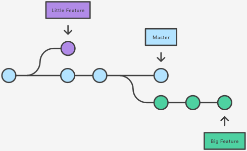
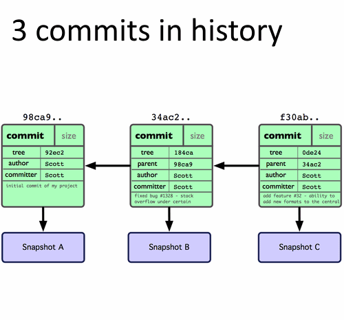

# Git Workshop

## What Is Git

* Linus Torvalds
* Version-Control System
* Used for SCM (Source-Control Management)
* Distributed
* "File System"

## Creating a New Repository

* Create a top level directory for the workshop
* Create a directory
* Initialize git in the new directory

```bash
mkdir 20181213_GitWorkshop
cd 20181213_GitWorkshop
```

```bash
mkdir MyRepo
cd MyRepo
git init
```

Result:

```none
Initialized empty Git repository in C:/20181213_GitWorkshop/MyRepo/.git/
```

## What a Repository Is

* Collection of files
* .git folder
* Verison Control

## Create a File and add it to the Repository

* Show the current repository status
* Create a file `HelloWorld.txt`
* Set the file contents to `Hello World!`
* Show the repository status
* Add the file to the Index
* Show the repository status
* Commit the file to the local repository
* Show the repository status
* Show repository log

```bash
git status
```

Result:

```none
On branch master

No commits yet

nothing to commit (create/copy files and use "git add" to track)
```

```bash
echo "Hello World!" > HelloWorld.txt
git status
```

Result:

```none
On branch master

No commits yet

Untracked files:
  (use "git add <file>..." to include in what will be committed)

        HelloWorld.txt

nothing added to commit but untracked files present (use "git add" to track)
```

```bash
git add HelloWorld.txt
git status
```

Result:

```none
On branch master

No commits yet

Changes to be committed:
  (use "git rm --cached <file>..." to unstage)

        new file:   HelloWorld.txt
```

```bash
git commit -m "Add HelloWorld.txt"
```

Result:

```none
[master 0fc8620] Add HelloWorld.txt
 1 file changed, 1 insertion(+)
 create mode 100644 HelloWorld.txt
```

```bash
git status
```

Result:

```none
On branch master
nothing to commit, working tree clean
```

```bash
echo "Hello World 2!" > HelloWorld2.txt
git add HelloWorld2.txt
git commit -m "Add HelloWorld2.txt"
```

Result:

```none
[master a9f956a] Add HelloWorld2.txt
 1 file changed, 1 insertion(+)
 create mode 100644 HelloWorld2.txt
```

## Workspace, Index, Local Repository

* Workspace - The visible files tracked, untracked, and .git
* Index - Staging for changes .git/index
* Local Repository (Object Store) - The local git database .git/objects


* Make changes in the workspace
* Stage (git add) changes in the Index
* Commit (git commit) changes to the Local Repository

## Viewing Commit History

```bash
git rev-list --all
```

Result:

```none
a9f956afcae5ba1b442fa4834c4912ac7659ca5f
af4eeb918df3f071e2769b4e7d94b8b744ead854
```

```bash
git rev-list --all --pretty
```

Result:

```none
commit a9f956afcae5ba1b442fa4834c4912ac7659ca5f
Author: Mark Kraus <mkraus@linkedin.biz>
Date:   Thu Dec 6 10:08:20 2018 -0800

    Add HelloWorld2.txt

commit af4eeb918df3f071e2769b4e7d94b8b744ead854
Author: Mark Kraus <mkraus@linkedin.biz>
Date:   Thu Dec 6 10:07:45 2018 -0800

    Add HelloWorld.txt
```

```bash
git log
```

Result:

```none
commit a9f956afcae5ba1b442fa4834c4912ac7659ca5f (HEAD -> master)
Author: Mark Kraus <mkraus@linkedin.biz>
Date:   Thu Dec 6 10:08:20 2018 -0800

    Add HelloWorld2.txt

commit af4eeb918df3f071e2769b4e7d94b8b744ead854
Author: Mark Kraus <mkraus@linkedin.biz>
Date:   Thu Dec 6 10:07:45 2018 -0800

    Add HelloWorld.txt
```

## Revert a Commit

* Create a Fail.txt file
* Stage the file
* Commit the file
* Revert the commit

```bash
echo 'Fail' > Fail.txt
git add Fail.txt
git commit -m 'Bad Commit'
git rev-list --all --pretty
```

Result

```none
[master e1d4a93] Bad Commit
 1 file changed, 1 insertion(+)
 create mode 100644 Fail.txt

commit e1d4a934146df81b969576e0a927d6b87ee4a497
Author: Mark Kraus <mkraus@linkedin.biz>
Date:   Thu Dec 6 10:50:08 2018 -0800

    Bad Commit

commit a9f956afcae5ba1b442fa4834c4912ac7659ca5f
Author: Mark Kraus <mkraus@linkedin.biz>
Date:   Thu Dec 6 10:08:20 2018 -0800

    Add HelloWorld2.txt

commit af4eeb918df3f071e2769b4e7d94b8b744ead854
Author: Mark Kraus <mkraus@linkedin.biz>
Date:   Thu Dec 6 10:07:45 2018 -0800

    Add HelloWorld.txt
```

```bash
git revert e1d4a934146df81b969576e0a927d6b87ee4a497 --no-edit
git rev-list --all --pretty
```

Result:

```none
[master f0b59b5] Revert "Bad Commit"
 1 file changed, 1 deletion(-)
 delete mode 100644 Fail.txt

commit f0b59b50bdd96f54d274fd99d40143d60bc1122c
Author: Mark Kraus <mkraus@linkedin.biz>
Date:   Thu Dec 6 10:55:35 2018 -0800

    Revert "Bad Commit"

    This reverts commit e1d4a934146df81b969576e0a927d6b87ee4a497.

commit e1d4a934146df81b969576e0a927d6b87ee4a497
Author: Mark Kraus <mkraus@linkedin.biz>
Date:   Thu Dec 6 10:50:08 2018 -0800

    Bad Commit

commit a9f956afcae5ba1b442fa4834c4912ac7659ca5f
Author: Mark Kraus <mkraus@linkedin.biz>
Date:   Thu Dec 6 10:08:20 2018 -0800

    Add HelloWorld2.txt

commit af4eeb918df3f071e2769b4e7d94b8b744ead854
Author: Mark Kraus <mkraus@linkedin.biz>
Date:   Thu Dec 6 10:07:45 2018 -0800

    Add HelloWorld.txt
```

## Reset to a commit

* Soft reset to the bad commit
* Hard reset to the last good commit

```bash
git reset --soft e1d4a934146df81b969576e0a927d6b87ee4a497
git status
git rev-list --all --pretty
```

Result:

```none
On branch master
Changes to be committed:
  (use "git reset HEAD <file>..." to unstage)

        deleted:    Fail.txt

commit e1d4a934146df81b969576e0a927d6b87ee4a497
Author: Mark Kraus <mkraus@linkedin.biz>
Date:   Thu Dec 6 10:50:08 2018 -0800

    Bad Commit

commit a9f956afcae5ba1b442fa4834c4912ac7659ca5f
Author: Mark Kraus <mkraus@linkedin.biz>
Date:   Thu Dec 6 10:08:20 2018 -0800

    Add HelloWorld2.txt

commit af4eeb918df3f071e2769b4e7d94b8b744ead854
Author: Mark Kraus <mkraus@linkedin.biz>
Date:   Thu Dec 6 10:07:45 2018 -0800

    Add HelloWorld.txt
```

```bash
git reset --hard a9f956afcae5ba1b442fa4834c4912ac7659ca5f
git rev-list --all --pretty
```

Result:

```none
HEAD is now at a9f956a Add HelloWorld2.txt

commit a9f956afcae5ba1b442fa4834c4912ac7659ca5f
Author: Mark Kraus <mkraus@linkedin.biz>
Date:   Thu Dec 6 10:08:20 2018 -0800

    Add HelloWorld2.txt

commit af4eeb918df3f071e2769b4e7d94b8b744ead854
Author: Mark Kraus <mkraus@linkedin.biz>
Date:   Thu Dec 6 10:07:45 2018 -0800

    Add HelloWorld.txt
```

## Revert vs Reset

Revert

* Revert undoes a previous commit as a new commit
* Revert is similar to manually making the changes and creating a new commit
* Revert is non-destructive

Reset

* Reset moves back to specific commit
* Reset is similar to wiping the history
* Reset is destructive

## What a Commit Is

* Point-in-time snapshot of the files
* Identified by a sha1 hash
* Hash made from commit metadata (Message, author, committer, parent) and the files


```bash
git cat-file -p a9f956afcae5ba1b442fa4834c4912ac7659ca5f
```

Result:

```none
tree a2e9bcdb7aa70f205f70681b3ea91debcc9d648f
parent af4eeb918df3f071e2769b4e7d94b8b744ead854
author Mark Kraus <mkraus@linkedin.biz> 1544119700 -0800
committer Mark Kraus <mkraus@linkedin.biz> 1544119700 -0800

Add HelloWorld2.txt
```

## Branches: Create, Checkout, Update, Delete

* Create a new branch
* Checkout a new branch
* Switch between branches
* Create a new branch in one command
* List branches
* Update a branch
* Delete branches

### Create a new branch

```bash
git branch newbranch
git checkout newbranch
```

Result:

```none
Switched to branch 'newbranch'
```

switch back to master

```bash
git checkout master
```

Result:

```none
Switched to branch 'master'
```

### Create a branch and checkout in one command

```bash
git checkout -b newbranch2
```

Result:

```none
Switched to a new branch 'newbranch2'
```

### List branches

```bash
git branch -v
```

Result:

```none
  master     a9f956a Add HelloWorld2.txt
  newbranch  a9f956a Add HelloWorld2.txt
* newbranch2 a9f956a Add HelloWorld2.txt
```

### Update a branch

Add a HelloPlanet.txt file in newbranch2

```bash
echo "Hello Planet!" > HelloPlanet.txt
git add HelloPlanet.txt
git commit -m "Add HelloPlanet.txt"
```

Result:

```none
[newbranch2 ac33cae] Add HelloPlanet.txt
 1 file changed, 1 insertion(+)
 create mode 100644 HelloPlanet.txt
```

```bash
git branch -v
ls
```

Result:

```none
  master     a9f956a Add HelloWorld2.txt
  newbranch  a9f956a Add HelloWorld2.txt
* newbranch2 ac33cae Add HelloPlanet.txt

HelloPlanet.txt  HelloWorld.txt  HelloWorld2.txt
```

checkout newbranch and list contents

```bash
git checkout newbranch
git branch -v
ls
```

Result:

```none
Switched to branch 'newbranch'

  master     a9f956a Add HelloWorld2.txt
* newbranch  a9f956a Add HelloWorld2.txt
  newbranch2 ac33cae Add HelloPlanet.txt

HelloWorld.txt  HelloWorld2.txt
```

switch back to newbranch2 and list

```bash
git checkout newbranch2
git branch -v
ls
```

Result:

```none
Switched to branch 'newbranch2'

  master     a9f956a Add HelloWorld2.txt
  newbranch  a9f956a Add HelloWorld2.txt
* newbranch2 ac33cae Add HelloPlanet.txt

HelloPlanet.txt  HelloWorld.txt  HelloWorld2.txt
```

```bash
git checkout master
git branch -v
ls
```

Result:

```none
Switched to branch 'master'

* master     a9f956a Add HelloWorld2.txt
  newbranch  a9f956a Add HelloWorld2.txt
  newbranch2 ac33cae Add HelloPlanet.txt

HelloWorld.txt  HelloWorld2.txt
```

### Delete a branch

Delete the newbranch branch

```bash
git branch -v
git branch -d newbranch
git branch -v
```

Result:

```none
* master     a9f956a Add HelloWorld2.txt
  newbranch  a9f956a Add HelloWorld2.txt
  newbranch2 ac33cae Add HelloPlanet.txt

Deleted branch newbranch (was e134966).

* master     a9f956a Add HelloWorld2.txt
  newbranch2 ac33cae Add HelloPlanet.txt
```

Try to delete the newbranch2 branch

```bash
git branch -d newbranch2
```

Result:

```none
error: The branch 'newbranch2' is not fully merged.
If you are sure you want to delete it, run 'git branch -D newbranch2'.
```

Force delete the branch

```bash
git branch -D newbranch2
```

Result:

```none
Deleted branch newbranch2 (was ac33cae).
```

## What is a branch

* A way to work on the same things in parallel
* Changes in one branch do not effect changes in another
* In reality, a branch is just a logical pointer to a commit





## Cloning a Repository

* Create and checkout a temp branch
* Create a new folder in the parent folder
* Clone MyRepo to new folder
* List remote repositories

```bash
git checkout -b temp
cd ..
mkdir MyRemoteRepo
cd MyRemoteRepo
git clone /c/20181213_GitWorkshop/MyRepo/ .
git status
git rev-list --all --pretty
ls
```

Result:

```none
Switched to a new branch 'temp'

Cloning into '.'...
done.

On branch master
Your branch is up to date with 'origin/master'.

nothing to commit, working tree clean

commit a9f956afcae5ba1b442fa4834c4912ac7659ca5f
Author: Mark Kraus <mkraus@linkedin.biz>
Date:   Thu Dec 6 10:08:20 2018 -0800

    Add HelloWorld2.txt

commit af4eeb918df3f071e2769b4e7d94b8b744ead854
Author: Mark Kraus <mkraus@linkedin.biz>
Date:   Thu Dec 6 10:07:45 2018 -0800

    Add HelloWorld.txt

HelloWorld.txt  HelloWorld2.txt
```

List remote repositories

```bash
origin  C:/git/20181213_GitWorkshop/MyRepo/ (fetch)
origin  C:/git/20181213_GitWorkshop/MyRepo/ (push)
```

## Syncing Changes to a Remote Repository

* Create HelloWorld3.txt
* Stage HelloWorld3.txt
* Commit HelloWorld3.txt
* Push changes to MyRepo
* View commit history
* Switch to MyRepo
* Checkout master
* View commit history

```bash
echo "Hello World 3!" > HelloWorld3.txt
git add HelloWorld3.txt
git commit -m "Add HelloWorld3.txt"
git push origin master
```

```none

[master 544dfbc] Add HelloWorld3.txt
 1 file changed, 1 insertion(+)
 create mode 100644 HelloWorld3.txt

Enumerating objects: 4, done.
Counting objects: 100% (4/4), done.
Delta compression using up to 12 threads
Compressing objects: 100% (2/2), done.
Writing objects: 100% (3/3), 326 bytes | 326.00 KiB/s, done.
Total 3 (delta 0), reused 0 (delta 0)
To C:/git/20181213_GitWorkshop/MyRepo/
   a9f956a..544dfbc  master -> master
```

Check MyRepo for changes

```bash
cd ../MyRepo
git checkout master
git rev-list --all --pretty
ls
```

Result:

```none
Switched to branch 'master'

commit 544dfbcdc69514e73cae38b0040ae649e9d565a6
Author: Mark Kraus <github@markekraus.com>
Date:   Fri Dec 7 11:37:07 2018 -0800

    Add HelloWorld3.txt

commit a9f956afcae5ba1b442fa4834c4912ac7659ca5f
Author: Mark Kraus <mkraus@linkedin.biz>
Date:   Thu Dec 6 10:08:20 2018 -0800

    Add HelloWorld2.txt

commit af4eeb918df3f071e2769b4e7d94b8b744ead854
Author: Mark Kraus <mkraus@linkedin.biz>
Date:   Thu Dec 6 10:07:45 2018 -0800

    Add HelloWorld.txt

HelloWorld.txt  HelloWorld2.txt  HelloWorld3.txt
```

## Pulling Changes from Remote Repositories

* Create HelloWorld4.txt
* Stage HelloWorld4.txt
* Commit HelloWorld4.txt
* View commit history
* Switch to MyRemoteRepo
* View commit history
* Pull changes
* View commit history

Make the changes in MyRepo

```bash
echo "Hello World 4!" > HelloWorld4.txt
git add HelloWorld4.txt
git commit -m "Add HelloWorld4.txt"
git rev-list --all --pretty
```

Result:

```none
[master cdd0c75] Add HelloWorld4.txt
 1 file changed, 1 insertion(+)
 create mode 100644 HelloWorld4.txt

commit cdd0c753106868b6e2aa8d629e9f9feb9de21a03
Author: Mark Kraus <github@markekraus.com>
Date:   Fri Dec 7 14:29:29 2018 -0800

    Add HelloWorld4.txt

commit 544dfbcdc69514e73cae38b0040ae649e9d565a6
Author: Mark Kraus <github@markekraus.com>
Date:   Fri Dec 7 11:37:07 2018 -0800

    Add HelloWorld3.txt

commit a9f956afcae5ba1b442fa4834c4912ac7659ca5f
Author: Mark Kraus <mkraus@linkedin.biz>
Date:   Thu Dec 6 10:08:20 2018 -0800

    Add HelloWorld2.txt

commit af4eeb918df3f071e2769b4e7d94b8b744ead854
Author: Mark Kraus <mkraus@linkedin.biz>
Date:   Thu Dec 6 10:07:45 2018 -0800

    Add HelloWorld.txt
```

Switch to MyRemoteRepo and fetch the changes

```bash
cd ../MyRemoteRepo
git fetch
git status
```

Result:

```none
remote: Enumerating objects: 4, done.
remote: Counting objects: 100% (4/4), done.
remote: Compressing objects: 100% (2/2), done.
remote: Total 3 (delta 1), reused 0 (delta 0)
Unpacking objects: 100% (3/3), done.
From C:/git/20181213_GitWorkshop/MyRepo
   544dfbc..cdd0c75  master     -> origin/master
 * [new branch]      temp       -> origin/temp

On branch master
Your branch is behind 'origin/master' by 1 commit, and can be fast-forwarded.
  (use "git pull" to update your local branch)

nothing to commit, working tree clean
```

Pull in the changes made in MyRepo

```bash
git pull
git rev-list --all --pretty
```

```none
Updating 544dfbc..cdd0c75
Fast-forward
 HelloWorld4.txt | 1 +
 1 file changed, 1 insertion(+)
 create mode 100644 HelloWorld4.txt

commit cdd0c753106868b6e2aa8d629e9f9feb9de21a03
Author: Mark Kraus <github@markekraus.com>
Date:   Fri Dec 7 14:29:29 2018 -0800

    Add HelloWorld4.txt

commit 544dfbcdc69514e73cae38b0040ae649e9d565a6
Author: Mark Kraus <github@markekraus.com>
Date:   Fri Dec 7 11:37:07 2018 -0800

    Add HelloWorld3.txt

commit a9f956afcae5ba1b442fa4834c4912ac7659ca5f
Author: Mark Kraus <mkraus@linkedin.biz>
Date:   Thu Dec 6 10:08:20 2018 -0800

    Add HelloWorld2.txt

commit af4eeb918df3f071e2769b4e7d94b8b744ead854
Author: Mark Kraus <mkraus@linkedin.biz>
Date:   Thu Dec 6 10:07:45 2018 -0800

    Add HelloWorld.txt
```

## What a Remote is

* "Remote" copy of the repository
* Same commit history
* Can be just another folder on the same System
* Can be hosted by a server, like Azure DevOps or GitHub
* Pull remote changes from the remote
* Push local changes to the remote

## Create Azure DevOps Repository

Walk through Azure DevOps portal

## Populate Empty Azure DevOps Repository from Existing Local Repository

* Add remote
* List remotes
* Push local to remote

```bash
cd ../MyRepo
git remote add origin https://lnkd-mkraus.visualstudio.com/GitWorkshopPrivate/_git/GitWorkshopPrivate
git remote -v
```

Result:

```none
origin  https://lnkd-mkraus.visualstudio.com/GitWorkshopPrivate/_git/GitWorkshopPrivate (fetch)
origin  https://lnkd-mkraus.visualstudio.com/GitWorkshopPrivate/_git/GitWorkshopPrivate (push)
```

Push locla to remote

```bash
git push
```

Result:

```none
Enumerating objects: 12, done.
Counting objects: 100% (12/12), done.
Delta compression using up to 12 threads
Compressing objects: 100% (7/7), done.
Writing objects: 100% (12/12), 1003 bytes | 334.00 KiB/s, done.
Total 12 (delta 2), reused 5 (delta 0)
remote: Analyzing objects... (12/12) (5 ms)
remote: Storing packfile... done (149 ms)
remote: Storing index... done (48 ms)
To https://lnkd-mkraus.visualstudio.com/GitWorkshopPrivate/_git/GitWorkshopPrivate
 * [new branch]      master -> master
```

Show updated in Azure DevOps

## Clone a Remote Azure DevOps Repository Locally

```bash
cd ..
mkdir AzDoRepo
cd AzDoRepo
git clone https://lnkd-mkraus.visualstudio.com/GitWorkshopPrivate/_git/GitWorkshopPrivate .
```

Result:

```none
Cloning into '.'...
remote: Azure Repos
remote: Found 12 objects to send. (93 ms)
Unpacking objects: 100% (12/12), done.
```

## Remote Notes

* Either Remote or local can be either empty or Populated
* Clone a remote repository to start with the remote
* Push a local repository to start locally
* Possible but complicated to work with remote local both populated
